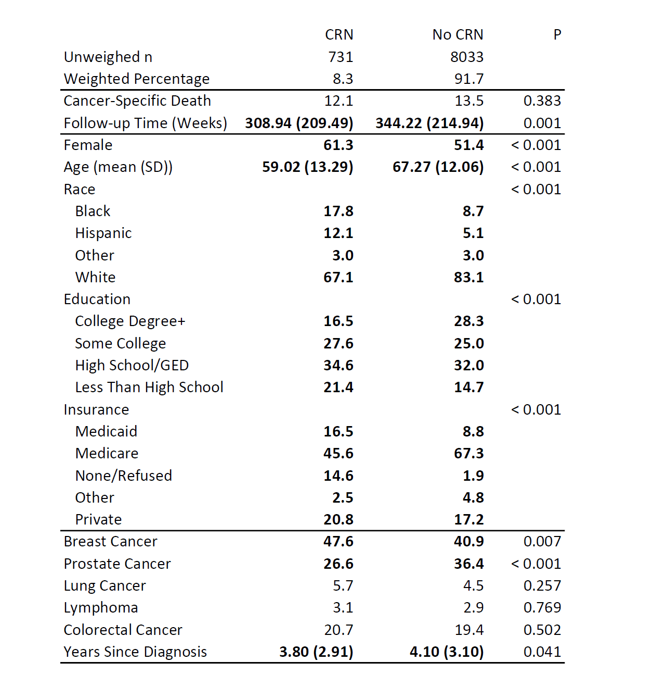

```{r setup, include=FALSE, message=FALSE, echo = FALSE, error=FALSE, warning=FALSE}
knitr::opts_chunk$set(echo = TRUE)
```

# Overview
> - Background
> - Objectives
> - Methods
> - Results
> - Conclusion

# United States Cancer Burden
> - Nearly 2 million new cases annually
> - Second leading cause of death (~ 600,000)
> - Incidence + death rate falling, but socioeconomic gaps remain
> 

# The Cost of Cancer Care 
> - More than 50% cancer patients have financial difficulty affording treatment or medication
> - Preventable cancers associated with higher treatment costs
> - Around 12% cancer patients rationed drugs received in order to cut costs (cost-related nonadherence)
> - Most cancer meds costs > $100,000/yr (4x higher than average cost to treat other chronic illnesses)


# More About Cost-Related Nonadherence
- Nonadherence = an individual doesn't follow through physician recommended plan for care

- Cost-related nonadherence (CRN)= primary reason for nonadherence is secondary to cost + financial barriers


# Study Objectives
1. Determine the prevalence of CRN in patients with lung, breast, colorectal, and prostate cancer or lymphoma

2. Determine whether CRN is associated with lower cancer-specific survival/mortality for patients with lung, breast, colorectal, and prostate cancer or lymphoma.


# National Health Interview Survey
- Nationally representative multistage probability sample conducted by the National Center for Health Statistics (NCHS) at the CDC
- ~100,000 individuals interviewed each year
- Low income and minority households oversampled; individuals with health conditions of interest (including cancer) oversampled within households

# Study Sample
- Individuals reporting a diagnosis of breast, prostate, lung, colon/rectal cancer or lymphoma 
- Diagnosed in past 10 years (in attempt to restrict to "current" cases)
- All diagnoses are self-reported


# Exposure
- Cost-related nonadherence
  - 3 questions asking participants if, in order to cut costs, they had:
    - Skipped medication doses?
    - Delayed taking medication doses?
    - Neglected to fill prescription?
- Needed but could not afford prescription medications in the last 12 months?
  - Coded CRN as **any yes**


# Outcome
- Cancer-specific survival/mortality
  - Record linkage to the National Death Index with ICD-10 codes
  - Not all respondents were eligbile for record linkage, excluded those under age 18, insufficient identifying information, no provided SSN, etc.
  - Follow-up time = Date of interview - final day in quarter/year when death was ascertained (because exact dates not available) 

# Conceptual Model

```{r, echo=FALSE, warning=FALSE, message = FALSE}
library(DiagrammeR)
#make dag
grViz("
	digraph causal {
	
	  # Nodes
	  node [shape = plaintext]

	  U [label = 'Income']
	  D [label = 'CRN']
	  Y [label = 'Mortality']
	  S [label = 'Sex']
	  I [label = 'Insurance']
	  R [label = 'Race']
	  A [label = 'Age']
	  X [label = 'Yrs Since Dx']
	  T [label = 'Cancer Subtype']
	  
	  # Edges
	  edge [color = black,
	        arrowhead = vee]
	  rankdir = LR
	  D -> Y
	  U -> D
	  U -> Y
	  U -> I
	  S -> D
	  S -> Y
	  I -> D
	  I -> Y
	  R -> D
	  R -> Y
	  R -> I
	  A -> I
	  A -> D
	  A -> Y
	  X -> Y
	  T -> D
	  T -> Y
	  R -> T
	  A -> T

	  # Graph
	  graph [overlap = true, fontsize = 10]
	}")

```

# Statistical Analysis, Pt 1
>- All analyses conducted in R 3.6.1 and RStudio 1.2.5019
>- Given unequal sampling probabilities we adjusted all analyses for survey design using the `survey` package in R
>- T tests and Chi-square tests comparing confounders in patients experiencing CRN to those not experiencing CRN

# Statistical Analysis, Pt 2
- Cox proportional hazards models: unadjusted and adjusted for age, sex, race, insurance, and years since diagnosis
- One set of models collapsing across sites, another stratified by site [breast and prostate models not adjusted for sex]
- Checked models for proportional hazards, linearity, influential cases

 
# Descriptive Statistics

```{r, echo = FALSE, message = FALSE, warning=FALSE}
library(tableone)
library(survey)
library(tidyverse)

analyticData <- read_csv("https://github.com/sarahVanAlsten/NHIS_Cancer/blob/master/data/analyticData.csv?raw=true")

#give nice names to variables so they will be printed out nicely in the table
analyticData <- analyticData %>%
  rowwise()%>%
  mutate(yrs_any = min(yrsBreast, yrsProst, yrsColorectal, yrsLymp, yrsLung, na.rm =T)) %>%
  ungroup() %>% #undo the rowwise part 
  mutate(Race = race_new,
         Female = SEX,
         Education = EduR,
         Smoking = SmokeR,
         Died = DEAD,
         Cancer_Mortality = cancMort,
         `Skipped Medication` = skipMed,
         `Delayed Medication` = delayMed,
         `Restrict Medication` = lessMed,
         `Couldnt Afford Medication` = BarrierMedR,
         Age = age_new,
         Breast = BreastCan,
         Prostate = ProstateCan,
         Lung = LungCan,
         Lymphoma = LymphomaCan,
         Colorectal = ColRectCan,
         Follow_up_Time = fuTime,
         Years_Since_Diagnosis = yrs_any,
         Insurance = insurance_new) %>%
  mutate(Race = ifelse(Race == 1, "White",
                       ifelse(Race == 2, "Black",
                              ifelse(Race == 3, "Hispanic", 
                                     ifelse(Race == 4,"Other", NA)))),
         Education = ifelse(Education == 1, "Less Than High School",
                            ifelse(Education == 2, "High School/GED",
                                   ifelse(Education ==3, "Some College",
                                          ifelse(Education == 4, "College Degree+", NA)))),
         Smoking = ifelse(Smoking == 0, "Never",
                          ifelse(Smoking == 1, "Former",
                                 ifelse(Smoking == 2, "Current", NA))),
         Insurance = ifelse(Insurance == 0, "None/Refused",
                            ifelse(Insurance == 1, "Medicaid",
                                   ifelse(Insurance == 2, "Medicare",
                                          ifelse(Insurance == 3, "Other",
                                                 ifelse(Insurance == 4, "Private", NA))))))

#set up the survey design for appropriate weighting
svy <-svydesign(ids = ~PSU, strata = ~ STRATA, weights = ~new_weight,
                nest = TRUE, data = analyticData)

#use subset to only keep those with a breast, prostate,  lymphoma, lung or colorectal
#cancer diagnosis in past 10 years and are eligible for mortality followup
#need to do it this way because SEs will be wrong for survey design if we
#eliminate those individuals first BEFORE setting up survey design (see survey vignette)
can.svy <- subset(svy, (yrsBreast <=10 | yrsProst <= 10 |
                          yrsColorectal <= 10 | yrsLymp <= 10 | yrsLung <=10) &
                    MORTELIG ==1)

#make a complete cases dataset for what we will be adjusting for
#again, do it here NOT before setting up survey to get correct Standard errors
comp.svy <- subset(can.svy, !is.na(age_new) & !is.na(fuTime) & !is.na(race_new) &
                     !is.na(SEX)& !is.na(insurance_new) &
                     !is.na(CRN) & !is.na(cancMort) & !is.na(yrs_any))


```

# Descriptive Statistics

{}


# Survival Curves
```{r, echo = FALSE, warning=FALSE, message=FALSE}
library(survminer)
fit <- survfit(Surv(fuTime, cancMort) ~ CRN,
               data = comp.svy$variables)
# Visualize with survminer
ggsurvplot(fit, data =comp.svy$variables, risk.table = TRUE)
```


# Cox Models Results
```{r, echo=FALSE, warning=FALSE, message=FALSE, results='asis'}
res <- 
  read_csv("https://github.com/sarahVanAlsten/NHIS_Cancer/blob/master/data/results.csv?raw=true") %>%
  select(-X1)

#0.8 needs to be changed to 0.80 
res[3,3] <- str_replace(res[3,3], "0.8", "0.80")

#print out the table
res %>%
  kableExtra::kable(format = "html") %>%
  kableExtra::kable_styling("striped") 


```

# Assumptions: Proportional Hazards
- All models with the exception of unadjusted lymphoma and adjusted lung cancer met the assumption of proportional hazards (p > 0.05)
- Graphical inspection of models not meeting assumption did not show substantial deviation from a constant hazard, however

```{r, echo = FALSE,message=FALSE, error=FALSE, warning = FALSE,fig.align='center'}
library(cowplot)
library(patchwork)
library(magick)

#show the zph plots (at least for the CRN variable)
p1 <- ggdraw() + draw_image("ly_zph.png", scale = 0.9)
p2 <- ggdraw() + draw_image("lu_zph.png", scale = 0.9)

p1 + p2
```

# Assumptions: Linearity and Influential Cases
- The assumption of linearity (for age, the sole continuous variable) was met
- Influential Cases: After removing potentially influential cases, there weren't enough cases for models to converge
- Generally, the only anomolous feature of influential cases was short follow up time, so we retained them in final models

# Discussion
- CRN was generally not associated with cancer mortality- if anything it would be protective (except for lung and prostate cancer)
- Removing influential cases took away the majority of cases with CRN + estimates were unstable, so the inverse associations observed in those cases should be interpreted with caution
- Why? Something for further exploration but could have to do with which treatments individuals skipped, age, other omitted variables which we did not have access to (e.g. cancer type, income)
- Hasn't been previous literature of CRN and mortality, but results aren't consistent with medical bankruptcy/mortality results --> possible that CRN is more mild form of financial distress?


# Strengths + Limitations
- Strengths: Follow-up for eligible cases was complete, population-representative sample, inclusion of multiple cancer subtypes makes a case for a more generalizable finding
- Limitations: Unable to adjust for all potential confounders [unmeasured], in some cases a limited sample size, self-report may be subject to bias, possible selection bias if cancer cases with CRN died early and weren't surveyed
- Future directions: other types of rarer cancers that have higher cost could be analyzed (e.g. bladder), studies with full assessment of confounders


# References
-	Kochanek KD, Murphy SL, Xu J, Arias E. Deaths: final data for 2017. National Center for Health Statistics (U.S.). Division of Vital Statistics., 2019;68(9). https://stacks.cdc.gov/view/cdc/79486.

- Dieleman JL, Baral R, Birger M, et al. US Spending on Personal Health Care and Public Health, 1996-2013. JAMA. 2016;316(24):2627. doi:10.1001/jama.2016.16885

- Mariotto AB, Robin Yabroff K, Shao Y, Feuer EJ, Brown ML. Projections of the Cost of Cancer Care in the United States: 2010–2020. JNCI J Natl Cancer Inst. 2011;103(2):117-128. doi:10.1093/jnci/djq495

- Americans Can't Keep Up with High Cost of Cancer Treatment. https://www.asbestos.com/featured-stories/high-cost-of-cancer-treatment. Published 2020. Accessed April 11, 2020. 

- Philipson, T. Non-Adherence in Health Care: Are Patients or Policy Makers Ill-Informed? https://www.forbes.com/sites/tomasphilipson/2015/05/08/non-adherence-in-health-care-are-patients-or-policy-makers-ill-informed. Published May 11, 2015. Accessed April 11, 2020. 
