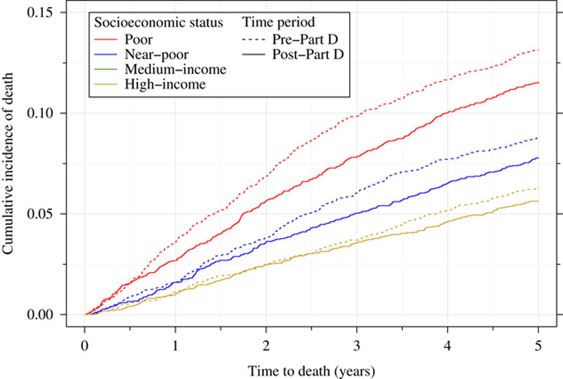

```{r setup, include=FALSE, message=FALSE, echo = FALSE, error=FALSE, warning=FALSE}
knitr::opts_chunk$set(echo = TRUE)
```

# United States Cancer Burden
> - Nearly 2 million new cases annually
> - Second leading cause of death (~ 600,000)
> - Incidence + death rate falling, but socioeconomic gaps remain
> 

# SES and Cancer


# The Cost of Cancer Care


# Cost-related Nonadherence


# Study Objectives
1. Determine the prevalence of CRN in patients with lung, breast, colorectal, and prostate cancer or lymphoma

2. Determine whether CRN is associated with lower cancer-specific survival for patients with lung, breast, colorectal, and prostate cancer or lymphoma.


# National Health Interview Survey
> - Nationally representative multistage probability sample conducted by the National Center for Health Statistics (NCHS) at the CDC
   - ~100,000 individuals interviewed each year
   - Low income and minority households oversampled; individuals with health conditions of interest (including cancer) oversampled within households

# Study Sample


# Exposure
- **Cost-related nonadherence**
  - 3 questions asking participants if, in order to cut costs, they had:
    - Needed but could not afford prescription medications in the last 12 months?
    - Skipped medication doses?
    - Delayed taking medication doses?
    - Neglected to fill prescription?
  - Coded CRN as **any yes**


# Outcome
- **Cancer-specific survival/mortality**
  - Record linkage to the National Death Index
    - NCHS used probabilistic matching to ascertain cause of death (ICD-10 codes)
  - Not all respondents were eligbile for record linkage: under age 18, insufficient identifying information, no provided SSN, etc.
  - Follow-up time = Date of interview - final day in quarter/year when death was ascertained (because exact dates not available) 

# Conceptual Model

```{r, echo=FALSE, warning=FALSE, message = FALSE}
library(DiagrammeR)
#make dag
grViz("
	digraph causal {
	
	  # Nodes
	  node [shape = plaintext]

	  U [label = 'Income']
	  D [label = 'CRN']
	  Y [label = 'Mortality']
	  S [label = 'Sex']
	  I [label = 'Insurance']
	  R [label = 'Race']
	  A [label = 'Age']
	  X [label = 'Yrs Since Dx']
	  T [label = 'Cancer Subtype']
	  
	  # Edges
	  edge [color = black,
	        arrowhead = vee]
	  rankdir = LR
	  D -> Y
	  U -> D
	  U -> Y
	  U -> I
	  S -> D
	  S -> Y
	  I -> D
	  I -> Y
	  R -> D
	  R -> Y
	  R -> I
	  A -> I
	  A -> D
	  A -> Y
	  X -> Y
	  T -> D
	  T -> Y
	  R -> T
	  A -> T

	  # Graph
	  graph [overlap = true, fontsize = 10]
	}")

```

# Statistical Analysis, Pt 1
>- All analyses conducted in R 3.6.1 and RStudio 1.2.5019
>- Given unequal sampling probabilities and probable selection bias for mortality-elgible participants, we adjusted all analyses for survey design using the `survey` package in R
>- T tests/Wilcoxon rank sign tests and Rao-Scott Chi-square tests comparing patients experiencing CRN to those not experiencing CRN:
  -Age, Sex, Race, Health Insurance Type, Education, vital status

# Statistical Analysis, Pt 2
>- Cox proportional hazards models: unadjusted and adjusted for age, sex, race, insurance, and years since diagnosis
 - One set of models collapsing across sites, another stratified by site [breast and prostate models not adjusted for sex]
 - Checked models for proportional hazards, linearity, influential cases
 - Violated proportional hazard: estimated HR separately for those with <= median follow-up time and those with > median follow-up time
 
# Descriptive Statistics

```{r, echo = FALSE, message = FALSE, warning=FALSE}
library(tableone)
library(survey)
library(tidyverse)

analyticData <- read_csv("https://github.com/sarahVanAlsten/NHIS_Cancer/blob/master/data/analyticData.csv?raw=true")

#give nice names to variables so they will be printed out nicely in the table
analyticData <- analyticData %>%
  rowwise()%>%
  mutate(yrs_any = min(yrsBreast, yrsProst, yrsColorectal, yrsLymp, yrsLung, na.rm =T)) %>%
  ungroup() %>% #undo the rowwise part 
  mutate(Race = race_new,
         Female = SEX,
         Education = EduR,
         Smoking = SmokeR,
         Died = DEAD,
         `Cancer Mortality` = cancMort,
         `Skipped Medication` = skipMed,
         `Delayed Medication` = delayMed,
         `Restrict Medication` = lessMed,
         `Couldnt Afford Medication` = BarrierMedR,
         Age = age_new,
         `Breast Cancer` = BreastCan,
         `Prostate Cancer` = ProstateCan,
         `Lung Cancer` = LungCan,
         Lymphoma = LymphomaCan,
         `Colorectal Cancer` = ColRectCan,
         `Follow up Time` = fuTime,
         `Years Since Diagnosis` = yrs_any,
         Insurance = insurance_new) %>%
  mutate(Race = ifelse(Race == 1, "White",
                       ifelse(Race == 2, "Black",
                              ifelse(Race == 3, "Hispanic", 
                                     ifelse(Race == 4,"Other", NA)))),
         Education = ifelse(Education == 1, "Less Than High School",
                            ifelse(Education == 2, "High School/GED",
                                   ifelse(Education ==3, "Some College",
                                          ifelse(Education == 4, "College Degree+", NA)))),
         Smoking = ifelse(Smoking == 0, "Never",
                          ifelse(Smoking == 1, "Former",
                                 ifelse(Smoking == 2, "Current", NA))),
         Insurance = ifelse(Insurance == 0, "None/Refused",
                            ifelse(Insurance == 1, "Medicaid",
                                   ifelse(Insurance == 2, "Medicare",
                                          ifelse(Insurance == 3, "Other",
                                                 ifelse(Insurance == 4, "Private", NA))))))

#set up the survey design for appropriate weighting
svy <-svydesign(ids = ~PSU, strata = ~ STRATA, weights = ~new_weight,
                nest = TRUE, data = analyticData)

#use subset to only keep those with a breast, prostate,  lymphoma, lung or colorectal
#cancer diagnosis in past 10 years and are eligible for mortality followup
#need to do it this way because SEs will be wrong for survey design if we
#eliminate those individuals first BEFORE setting up survey design (see survey vignette)
can.svy <- subset(svy, (yrsBreast <=10 | yrsProst <= 10 |
                          yrsColorectal <= 10 | yrsLymp <= 10 | yrsLung <=10) &
                    MORTELIG ==1)

#make a complete cases dataset for what we will be adjusting for
#again, do it here NOT before setting up survey to get correct Standard errors
comp.svy <- subset(can.svy, !is.na(age_new) & !is.na(fuTime) & !is.na(race_new) &
                     !is.na(SEX)& !is.na(insurance_new) &
                     !is.na(CRN) & !is.na(cancMort) & !is.na(yrs_any))


#table of descriptives : include cancer type
#to see whether there's a diff by subtype
kableone(
  svyCreateTableOne(vars = c("Race", "Education",
                             "`Cancer Mortality`", "Female",
                             "Age",
                             "Insurance","`Breast Cancer`", "`Prostate Cancer`",
                             "`Lung Cancer`", "Lymphoma", "`Colorectal Cancer`",
                             "`Follow up Time`", "`Years Since Diagnosis`"),
                    strata = "CRN", 
                    data = comp.svy,
                    factorVars = c("Race", "Education", 
                             "`Cancer Mortality`",
                              "Female",
                             "Insurance","`Breast Cancer`", "`Prostate Cancer`",
                             "`Lung Cancer`", "Lymphoma", "`Colorectal Cancer`")),
  align = "r", padding = 1
  )

```

# Survival Curves
```{r, echo = FALSE, warning=FALSE, message=FALSE}
fit <- survfit(Surv(fuTime, cancMort) ~ CRN,
               data = comp.svy$variables)
# Visualize with survminer
ggsurvplot(fit, data =comp.svy$variables, risk.table = TRUE)
```

```{r}

```


